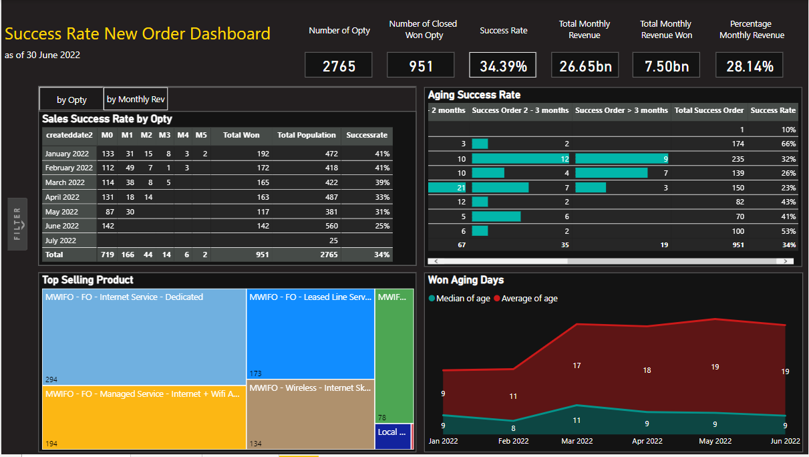
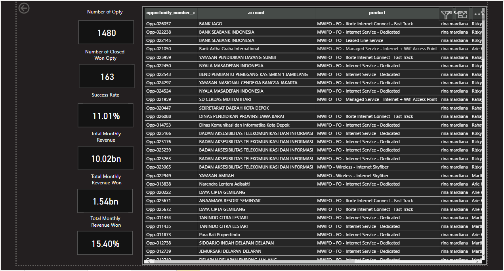
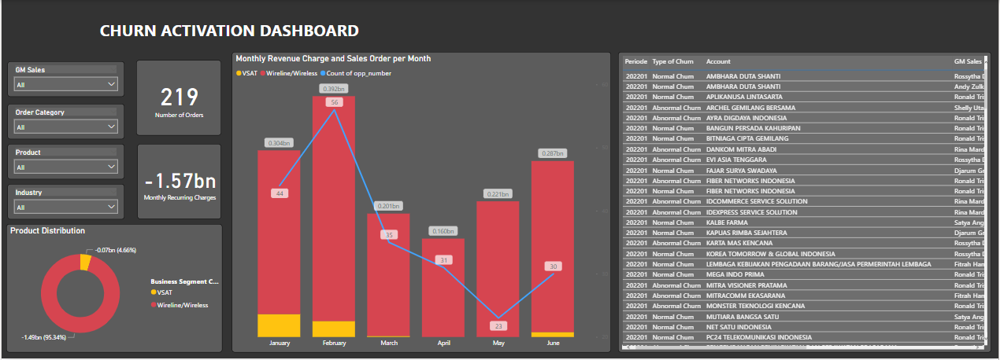
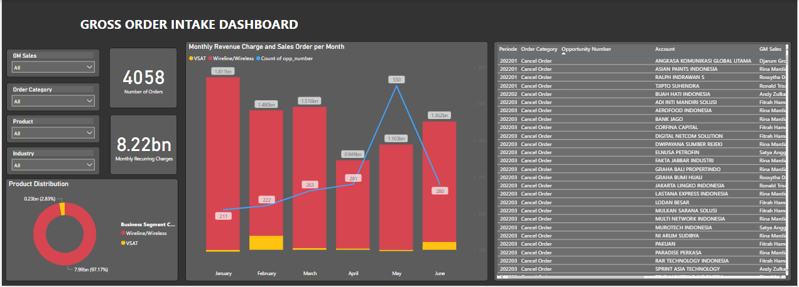

# Overview
Data Analyst & BI Specialist with experience in data visualization, dashboarding, and analytical modeling. I’m interested in building clean, reproducible workflows using **Python**, **SQL**, and modern **BI tools**. Here you’ll find projects on analytics, forecasting, data pipelines, and exploratory data analysis. My personal interests which I try to implement into my personal projects include: sports (basketball, football, boxing, etc.) and music.

# Projects

## Dashboard

During my tenure working as Data Analyst in the Business Intelligence team, I was part of the team in building a dashboard for multiple purposes.
The process includes processes such as extracting data from Salesforce and Data Lake using SQL, modifying and cleaning up data in Excel using VBA Programming, communicating with other departments to confirm data context, communicating with the CFO to understand the purpose of the dashboard, and finally creating the dashboard itself. With all of the dashboards below, we have always uphold the concept of having the users view data easily in the dashboard without sacrificing the details of the data as well as having so much information so that the true purpose of the dashboard is lost.

### Sales Team KPI

One of the dashboard that we have created is a KPI Review on the Sales Team to be used for evaluation. The metrics we chose to display are: Success Rate, Total Value of Contract, Contract Retention Duration, Number of Renewed Contracts and more. We made it so that dashboard viewer are able to review the metrics based on the Sales Team Level: Salesperson, Sales Manager, as well as General Manager of Sales. In order for the metrics to be reviewed on multiple levels. Furthermore, we added a drill down option in order for dashboard viewers to look into the more detailed information.

*Test

## Contact Information
[LinkedIn](https://www.linkedin.com/in/michaeltanuwidjaja/)

[Email](michaelb.tanuwidjaja@gmail.com)
