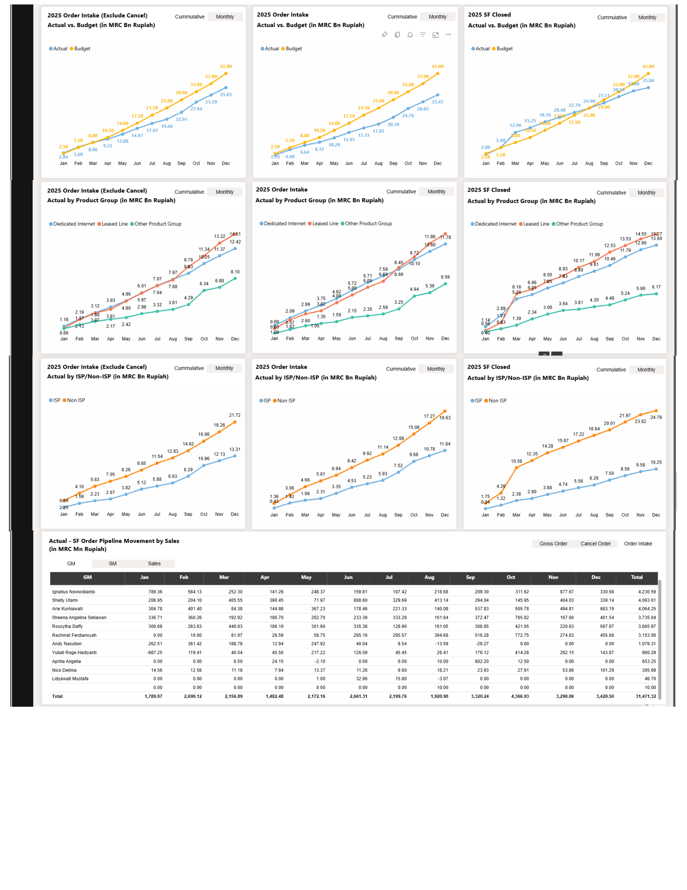
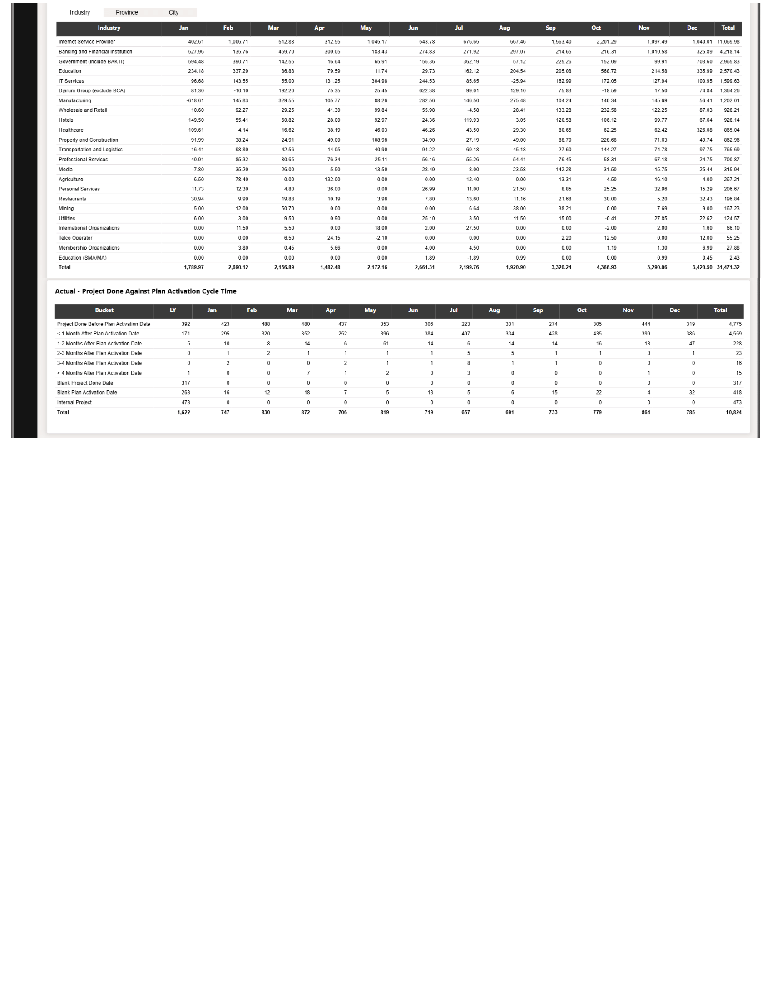

# Overview
Data Analyst & BI Specialist with experience in data visualization, dashboarding, and analytical modeling. I’m interested in building clean, reproducible workflows using **Python**, **SQL**, and modern **BI tools**. Here you’ll find projects on analytics, forecasting, data pipelines, and exploratory data analysis. My personal interests which I try to implement into my personal projects include: sports (basketball, football, boxing, etc.) and music.

# Projects

## Dashboard

During my tenure working as Data Analyst in the Business Intelligence team, I was part of the team in building a dashboard for multiple purposes.
The process includes processes such as extracting data from Salesforce and Data Lake using SQL, modifying and cleaning up data in Excel using VBA Programming, communicating with other departments to confirm data context, communicating with the CFO to understand the purpose of the dashboard, and finally creating the dashboard itself. With all of the dashboards below, we have always uphold the concept of having the users view data easily in the dashboard without sacrificing the details of the data as well as having so much information so that the true purpose of the dashboard is lost.

### Sales Team KPI

One of the dashboard that we have created is a KPI Review on the Sales Team to be used for evaluation. The metrics we chose to display are: Success Rate, Total Value of Contract, Contract Retention Duration, Number of Renewed Contracts and more. We made it so that dashboard viewer are able to review the metrics based on the Sales Team Level: Salesperson, Sales Manager, as well as General Manager of Sales. In order for the metrics to be reviewed on multiple levels. Furthermore, we added a drill down option in order for dashboard viewers to look into the more detailed information.

Main Dashboard Page:

Drilled Down Dashboard Page:

Other Details Dashboard Page:

## Dashboard (Extended Analysis – Order-to-Cash Overview)

In addition to the Sales Team KPI dashboard above, this repository also includes a comprehensive **Order-to-Cash (O2C) performance dashboard**, available in PDF format:

Main Dashboard Page:

Supporting Dashboard Pages:

This dashboard provides an executive-level view of **order intake, pipeline health, execution progress, and financial performance**, supporting both operational monitoring and strategic decision-making.

### Key Analytical Components

#### 1. Order Intake & Waterfall Analysis
The dashboard presents **order intake waterfall charts** for both:
- **Recurring contracts**
- **One-time contracts (OTC)**

These views illustrate how the order pipeline evolves from:
- Current orders  
- New orders  
- Cancellations  
- Pending sales processes  
- Successfully closed deals  

This structure enables stakeholders to clearly identify **drivers of growth, leakage points, and pipeline risk** across the sales lifecycle.

#### 2. Aging Analysis (Recurring & OTC)
Dedicated **aging tables** segment outstanding orders by:
- Not yet due
- 1–14 days overdue
- 15–30 days overdue
- Over 30 days overdue

This allows teams to:
- Monitor operational bottlenecks
- Identify delayed activations
- Prioritize follow-ups based on financial exposure and aging risk

#### 3. Pipeline Movement Tracking
Monthly pipeline movement tables track:
- Beginning balance
- New contract additions
- Contract cancellations
- Project completions
- Ending balance

This view supports **forecast validation** and helps management understand whether pipeline changes are driven by sales velocity, churn, or execution delays.

#### 4. Budget vs Actual Performance
The dashboard includes **cumulative and monthly comparisons** of:
- Order intake vs budget
- SF closed orders vs budget

These comparisons are further segmented by:
- Product group
- Sales channel (ISP vs Non-ISP)
- Individual sales contributors

This allows finance and leadership teams to evaluate **performance against targets** at multiple organizational levels.

#### 5. Industry, Region, and Sales Segmentation
Additional breakdowns analyze order intake by:
- Industry
- Province and city
- Individual sales representatives

These dimensions help uncover:
- Geographic demand patterns
- Industry concentration risk
- Sales productivity differences across regions and roles

### Business Impact
This dashboard was designed to:
- Bridge **Sales, Finance, and Operations**
- Support **CFO-level performance reviews**
- Enable **data-driven forecasting and accountability**
- Maintain clarity without sacrificing analytical depth

The work demonstrates my experience translating complex, multi-source datasets into **clear, decision-oriented business intelligence artifacts**.
## Contact Information
[LinkedIn](https://www.linkedin.com/in/michaeltanuwidjaja/)

[Email](michaelb.tanuwidjaja@gmail.com)
